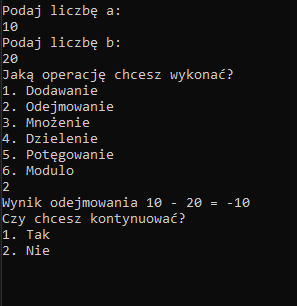
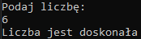
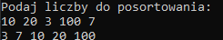
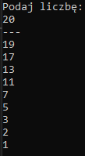
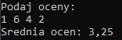
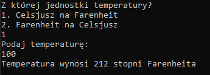
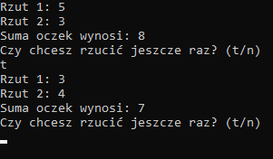
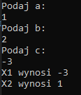

# Zadania z C#

Te repozytorium zawiera 8 programów wykonanych w języku C#.

## Programy

### 1. Kalkulator
Program umożliwiający wykonanie jednej z 6 operacji na dowolnych 2 liczbach (dodawanie, odejmowanie, mnożenie, dzielenie, potęgowanie i modulo). Program sprawdza czy podane przez użytkownika dane są prawidłowe (czy są one liczbami, i czy użytkownik nie próbuje dzielić przez 0). Program umożliwia również wykonanie nowej operacji po zakończeniu poprzedniej.  
  
*Przykład działania programu "Kalkulator"*

### 2. Liczba doskonała
Program sprawdza czy podana liczba jest liczbą doskonałą, czyli sumą wszystkich swoje dzielników (np. *6* jest sumą *1+2+3*). Program sprawdza czy liczba podana przez użytkownika jest liczbą całkowitą większą od zera.  
  
*Przykład działania programu "Liczba doskonała"*

### 3. Sortowanie bąbelkowe
Program sortuje dowolną ilość liczb podanych przez użytkownika w kolejności rosnącej używając algorytmu [sortowania bąbelkowego](https://en.wikipedia.org/wiki/Bubble_sort).  
  
*Przykład działania programu "Sortowanie bąbelkowe"*

### 4. Liczby pierwsze

Program pobiera od użytkownika liczbę, i podaje wszystkie liczby pierwsze mniejsze od niej.  
  
*Przykład działania programu "Liczby pierwsze"*

### 5. Kalkulator średnich ocen
Program oblicza średnią z dowolnej ilości liczb całkowitych podanych przez użytkownika.  
  
*Przykład działania programu "Kalkulator średnich ocen"*

### 6. Zamiana jednostek
Program zamienia temperaturę z jednej jednostki na drugą, albo z stopni Celsjusza na stopnie Fahrenheita, lub z stopni Fahrenheita na stopnie Celsjusza.
  
*Przykład działania programu "Zamiana jednostek"*

### 7. Symulator gry w kości
Program losuje 2 liczby od 1 do 6, i dodaje je do siebie, symulując 2 rzuty kośćmi. Program umożliwia ponowny rzut  
  
*Przykład działania programu "Symulator gry w kości"*

### 8. Kalkulator równań kwadratowych
Program oblicza równania kwadratowe dla liczb *a*, *b* i *c* podanych przez użytkownika, podając możliwe wartości liczby x. Program wypisuje x1 i x2 jeżeli delta jest dodatnia, x jeżeli delta wynosi 0, i nie wypisuje nic jeżeli delta jest ujemna.  
  
*Przykład działania programu "Kalkulator równań kwadratowych"*

## Uruchomienie programu
1. Sklonuj repozytorium używając komendy `git clone https://github.com/Fox-Coffee/zadania-z-c-.git`
2. Otwórz plik `Program.cs` w środowisku wspierającym język C# (np. Visual Studio)
3. Skompiluj i uruchom projekt używając skrótu *F5* + *Ctrl*

## Licencja
Projekt ten operuje na licencji MIT. Aby dowiedzieć się więcej, przeczytaj [licencje zawartą z kopią kodu źródłowego](./LICENSE).